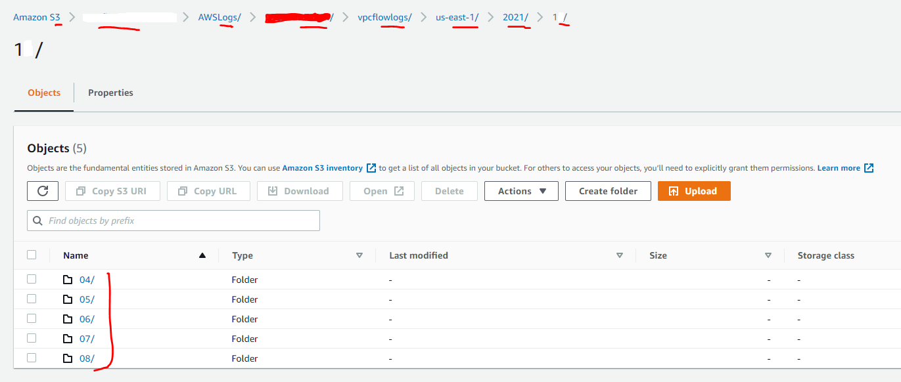
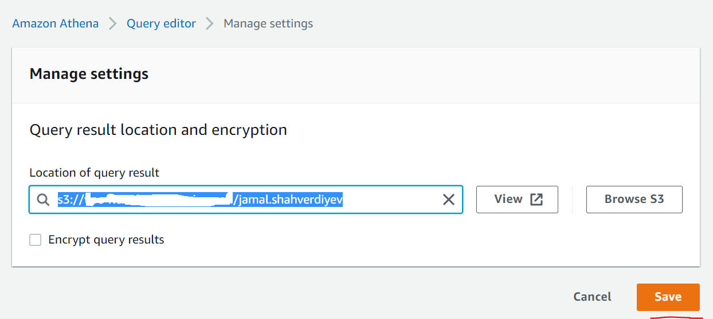
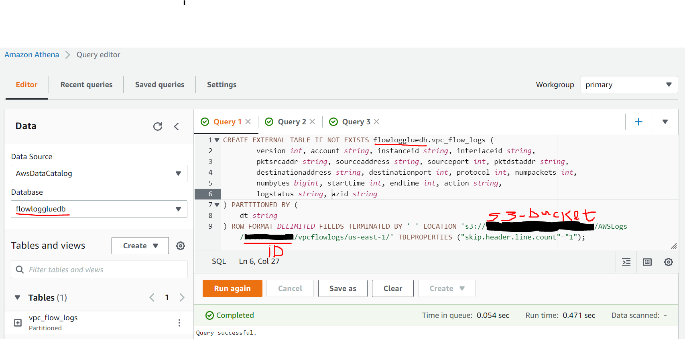
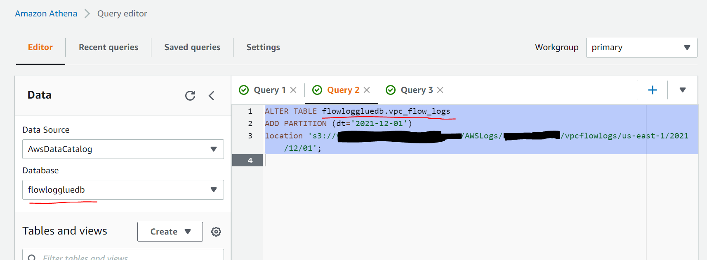
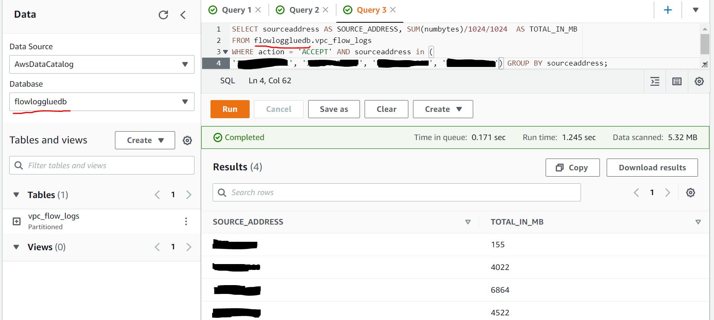
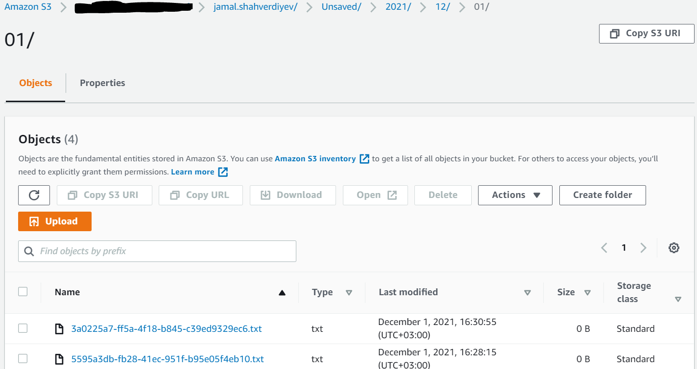

# The goal of this article comes from project requirements. We wanted to understand how much traffic is going between EKS master and worker nodes in AWS to understand AWS costs. We wanted to understand price per 1GB traffic between AZs (same region) and for different regions

## Project requirements

- Get total IN/OUT of the traffic for day/month
- Get total IN/OUT of the traffic by source/destination IP addresses

### We could achieve that with `Grafana dashboards` and `Container Insights` boards but it was very unusable for the total in/out. After tests and deep research I found [`AWS official and easy way with VPC flow logs`](https://aws.amazon.com/blogs/networking-and-content-delivery/using-vpc-flow-logs-to-capture-and-query-eks-network-communications/). VPC will send all logs with the structure which we will define to the `AWS S3` but to extract and use this collected data we must use [`AWS ATHENA`](https://docs.aws.amazon.com/athena/)

- [`VPC flow logs`](https://docs.aws.amazon.com/vpc/latest/userguide/flow-logs.html) responsible to collect and send logs with some range interval to the `AWS s3`
- [`AWS Athena`](https://docs.aws.amazon.com/athena/) gives us functionality to use SQL syntax to collect data from VPC flow logs.

#### To use this wonderful stuff we need S3 bucket to store logs from VPC in the same region where deployed EKS cluster(In my case it is deployed in the `us-east-1` region. For the security reason data encryption is enabled for this bucket). ARN of the S3 will be used at the creation time of VPC Flow logs. After that `AWS Athena` will create glue to use database name `flowlog_gb_glue_name` variable from `vars.tf` file. All these stuff will be created with terraform codes. Just clone this repository and execute the following command (of course variables for the access and secret key with region must be defined)

```bash
$ terraform init
$ terraform plan && echo yes | terraform apply
```

#### When terraform code files creates [`vpc flow logs`](https://docs.aws.amazon.com/vpc/latest/userguide/flow-logs.html) it is going to use new created `AWS S3` ARN, filter ALL type of traffic, set `10` minutes of the aggregation interval, do partition of the logs for each `24` hour and choose log record format to Custom as the following

```bash
${version} ${account-id} ${instance-id} ${interface-id} ${pkt-srcaddr} ${srcaddr} ${srcport} ${pkt-dstaddr} ${dstaddr} ${dstport} ${protocol} ${packets} ${bytes} ${start} ${end} ${action} ${log-status} ${az-id}
```

#### After some time go to the S3 bucket look at the folder structure which created there:



#### Then open [Athena](https://docs.aws.amazon.com/athena/latest/ug/vpc-flow-logs.html) (Query Data in S3 using SQL) service in AWS and define place where will be saved all results of our queries. In my case is: `s3://s3-bucket-name/jamal.shahverdiyev`



#### Create table for the log structure inside of database which we have defined in `flowlog_gb_glue_name` variable of `vars.tf` file. Structure of the fields must be same as we defined inside of the `flow logs` when we created. Please define correct S3 name and your own `Account ID`(Red deleted space) of AWS



```sql
CREATE EXTERNAL TABLE IF NOT EXISTS flowloggluedb.vpc_flow_logs (
        version int,
        account string,
        instanceid string,
        interfaceid string,
        pktsrcaddr string,
        sourceaddress string,
        sourceport int,
        pktdstaddr string,
        destinationaddress string,
        destinationport int,
        protocol int,
        numpackets int,
        numbytes bigint,
        starttime int,
        endtime int,
        action string,
        logstatus string,
	    azid string
) PARTITIONED BY (
    dt string
) ROW FORMAT DELIMITED FIELDS TERMINATED BY ' ' LOCATION 's3://s3-bucket-name/AWSLogs/write-your-aws-account-id/vpcflowlogs/us-east-1/' TBLPROPERTIES ("skip.header.line.count"="1");
```

#### Create partition to quick search (Don't forget write right bucket name and `Account ID`)



```sql
ALTER TABLE flowloggluedb.vpc_flow_logs
ADD PARTITION (dt='2021-12-01')
location 's3://s3-bucket-name/AWSLogs/write-your-aws-account-id/vpcflowlogs/us-east-1/2021/12/01';
```

#### Send SQL query to get total traffic in megabytes from EKS worker nodes



```sql
SELECT sourceaddress AS SOURCE_ADDRESS, SUM(numbytes)/1024/1024  AS TOTAL_IN_MB
FROM flowloggluedb.vpc_flow_logs
WHERE action = 'ACCEPT' AND sourceaddress in (
'10.10.10.151', '10.10.10.174', '10.10.10.229', '10.10.10.40') GROUP BY sourceaddress;
```

#### After queries results will be saved in S3 bucket like as the following screen



#### With this way we can formulate any type of SQL queries to get information between services, pods and nodes(`source`/`destination`). I hope it will be useful to someone
